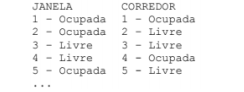

Uma empresa possui onibus com 48 lugares (24 nas janelas e 24 no corredor) e faz o trajeto SJC -> Sao Paulo -> Curitiba -> Florianopolis. Faça um algoritmo que utilize dois vetores para controlar as poltronas ocupadas no corredor e na janela. Consiere que 0 representa poltrona desocupada e 1, poltrona ocupada

User switch-case e funçoes para implementar as seguintes opções:

1) Vender passagem.
Quando esta opção for escolhida, deverá ser perguntado se o usuario deseja janela ou corredor e 
o numero da poltrona. O algoritmo deverá, então, dar uma das seguintes mensagens:
*Venda efetivad - se a poltrona solicitada estiver livre, marcando-a como ocupada.
*Poltrona ocupada - se a poltrona solicitada nao estiver disponivel para venda.
*Onibus lotado - quando todas as poltronas ja estiverem ocupadas.
*Marcar destino - 1(sao paulo),2(curitiba) e 3(florianopolis).

2)Mostrar mapa de ocupação do onibus
Quando essa opção for escolhida, devera ser mostrada uma listagem conforme a seguir:

3) Total vendido.
Quando essa opção for escolhida deve-se mostrar o montante obtido pela emprresa. Considere que
cada destino tem um custo diferente: 1)sao paulo = R$ 28,00 2) Curitiba = R$159,00 e 3)Florianopolis = R$188,00.

4) Encerrar.
Mantenha o programa dentro de um loop e quando for escolhida a opção Encerrar, a execução do
programa deverá ser finalizada.